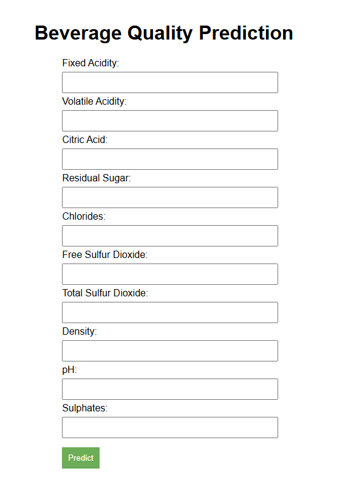

# End to End Beverage Quality Prediction Project 

### Workflows--ML Pipeline

1. Data Ingestion
2. Data Validation
3. Data Transformation (Feature engineering, Data preprocessing)
4. Model Trainer
5. Model Evaluation with MLflow and Dagshub

## Workflow for developing different componenets

1. Update config.yaml for data ingestion
2. Update schema.yaml for data validation
3. Update params.yaml when parameters are needed to be specified
4. Update the entity
5. Update the configuration manager in src/config
6. Update the components
7. Update the pipeline for training and batch prediction
8. Update the main.py